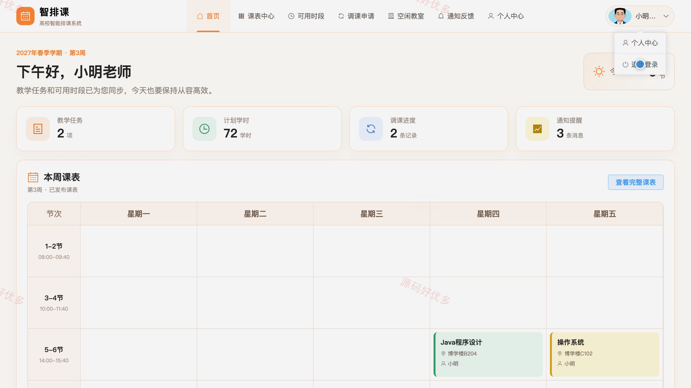
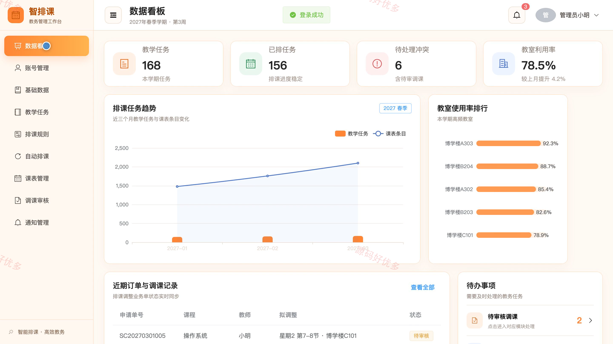
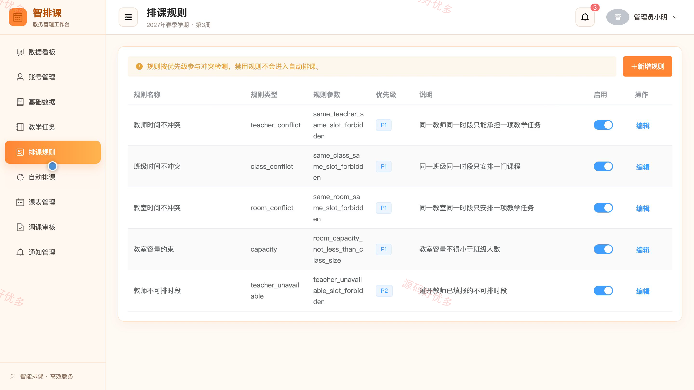
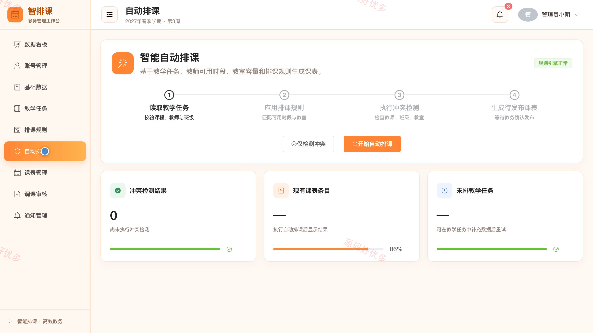
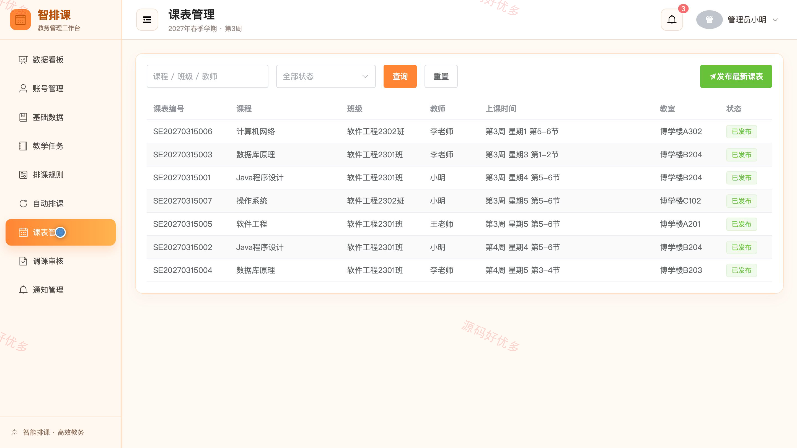

## 源码问题查看主页咨询

### 一、关键词
高校排课、智能排课、课表编排、教室调度、教学计划

### 二、作品包含
源码+数据库+全套环境和工具资源+本地部署教程

### 三、项目技术
前端技术： Html、Css、Js、Vue3.4、Element-Plus
后端技术：Java、SpringBoot3.2.0、MyBatis-Plus

### 四、运行环境（以下版本亲测，其他版本兼容性请自行测试）
开发工具：IDEA/eclipse + VSCODE

数据库：MySQL5.7+（共19张表）

数据库管理工具：Navicat10以上版本

环境配置软件： JDK17 + Maven3.6.3

前端Nodejs：16+

浏览器：谷歌浏览器

### 五、项目介绍
项目编号：bs024A

高校智能排课系统面向学生、教师和管理员，围绕教学任务、教师可用时间、教室容量与班级冲突开展自动排课、冲突检测、课表发布和调课审核，实现高校课表编排与教学资源协同管理。

角色：学生、教师、管理员

学生功能：账号登录与个人中心、个人课表查询、班级课表查询、调课申请、空闲教室查询、排课反馈、教务通知。

教师功能：账号登录与个人中心、教学任务查询、可用时间维护、教师课表查询、班级课表查询、调课申请、空闲教室查询、冲突反馈。

管理员功能：账号管理、基础数据管理、教学任务管理、排课规则管理、自动排课、冲突检测与课表发布、调课审核、统计分析与通知管理。

### 六、运行截图

